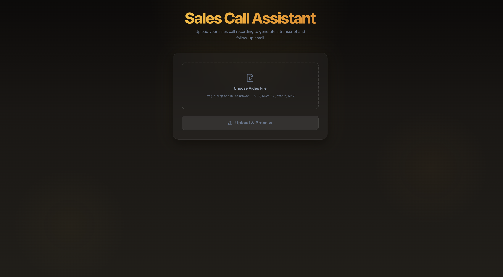
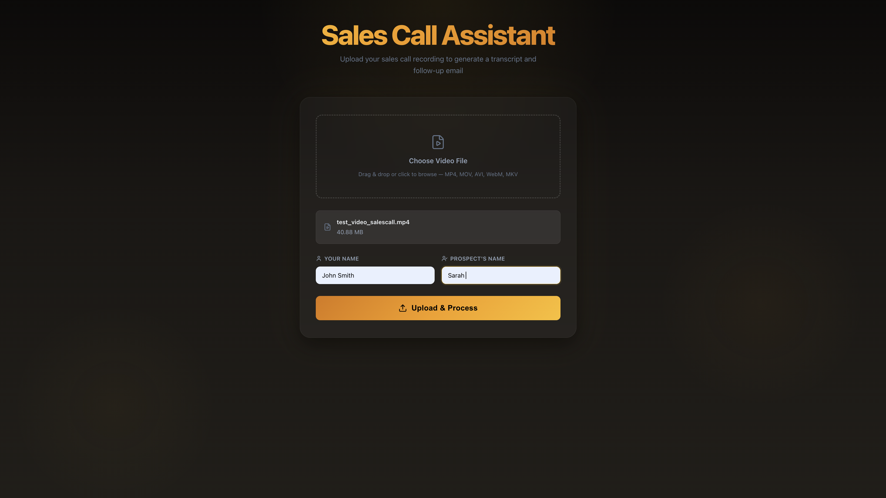
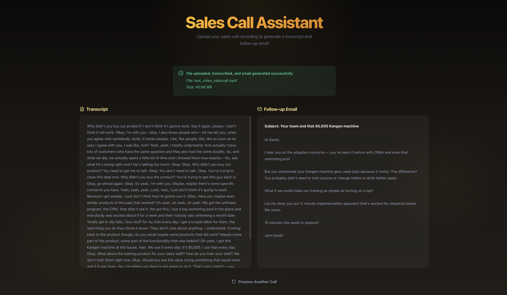

# Sales Call Assistant

AI-powered tool that transcribes sales call recordings and generates personalized follow-up emails.

## Screenshots

| Upload Interface | File Selected | Transcript & Email |
|:---:|:---:|:---:|
|  |  |  |

## Features

- **Video Upload** — Drag-and-drop or click to upload sales call recordings (MP4, MOV, AVI, WebM, MKV)
- **AI Transcription** — Automatic speech-to-text using AssemblyAI
- **AI Email Generation** — Personalized follow-up emails generated by Anthropic Claude
- **Name Personalization** — Customize salesperson and prospect names for tailored emails

## Tech Stack

**Frontend:** React, Vite, JavaScript, Axios, Lucide React

**Backend:** FastAPI, Python, Uvicorn

**APIs:** AssemblyAI (transcription), Anthropic Claude (email generation)

## Getting Started

### Prerequisites

- Python 3.10+
- Node.js 18+
- [AssemblyAI API key](https://www.assemblyai.com/)
- [Anthropic API key](https://console.anthropic.com/)

### Backend

```bash
cd backend
python -m venv venv
source venv/bin/activate
pip install -r requirements.txt
```

Create a `.env` file from the example:

```bash
cp .env.example .env
```

Add your API keys to `.env`:

```
ASSEMBLYAI_API_KEY=your_key_here
ANTHROPIC_API_KEY=your_key_here
```

Start the server:

```bash
uvicorn app.main:app --reload
```

The API will be available at `http://localhost:8000`.

### Frontend

```bash
cd frontend
npm install
npm run dev
```

The app will be available at `http://localhost:5173`.

## Project Structure

```
sales-call-assistant/
├── backend/
│   ├── app/
│   │   ├── routers/
│   │   │   └── calls.py          # Upload & processing endpoint
│   │   ├── services/
│   │   │   ├── transcription.py   # AssemblyAI integration
│   │   │   └── email_generator.py # Anthropic Claude integration
│   │   └── main.py               # FastAPI app setup
│   ├── uploads/                   # Temporary file storage
│   ├── requirements.txt
│   └── .env.example
├── frontend/
│   ├── src/
│   │   ├── App.jsx                # Main application component
│   │   ├── App.css                # Component styles
│   │   └── index.css              # Global styles & theme
│   ├── public/
│   │   └── favicon.svg
│   └── index.html
└── images/                        # Screenshots
```

## Future Improvements

- SQLite database for storing call history and transcripts
- Deployment to cloud hosting
- User authentication and multi-user support
